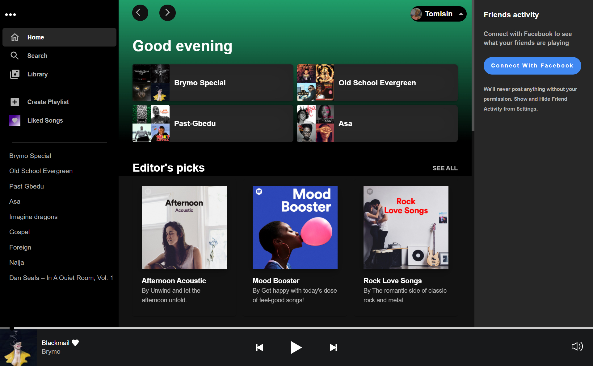

# Spotify Clone Application

This is a front-end clone of the Spotify web player. The UI was modeled after the Spotify desktop app interface using React Js, Spotify Web API, Redux for state management, and Material UI for styling.
Users can log in to the application with their Spotify account details, view playlists, select preferred playlist and listen to their favorite music.

## Requirements 

- You must be using a Spotify premium account.
- Your Spotify email must be added to the app dashboard as a user. 

To do that, please send me your Spotify email on Twitter-[@theracheltomi](https://twitter.com/racheltomidev) or send an email to [tomisinrachel@gmail.com](mailto:tomisinrachel@gmail.com).

## Preview Link

https://tomi-spotify.vercel.app/

## Authentication

This project uses the spotify OAuth 2.0 service for authenticating the users. [Check for more information](https://developer.spotify.com/documentation/general/guides/authorization/).

## Tech/Framework Used

- React Js
- Redux
- Material UI
- CSS
- [Spotify Web Api](https://developer.spotify.com/documentation/web-api/)

## Installation

This project requires node and npm installed globally.

Clone the repository to a directory of your choosing

```sh
$ git clone https://github.com/Racheal-spec/Tomi-spotify-clone.git
```

Install the necessary packages

```sh
$ npm install
```

To run the server

```sh
$ npm start
```

#### Demo




