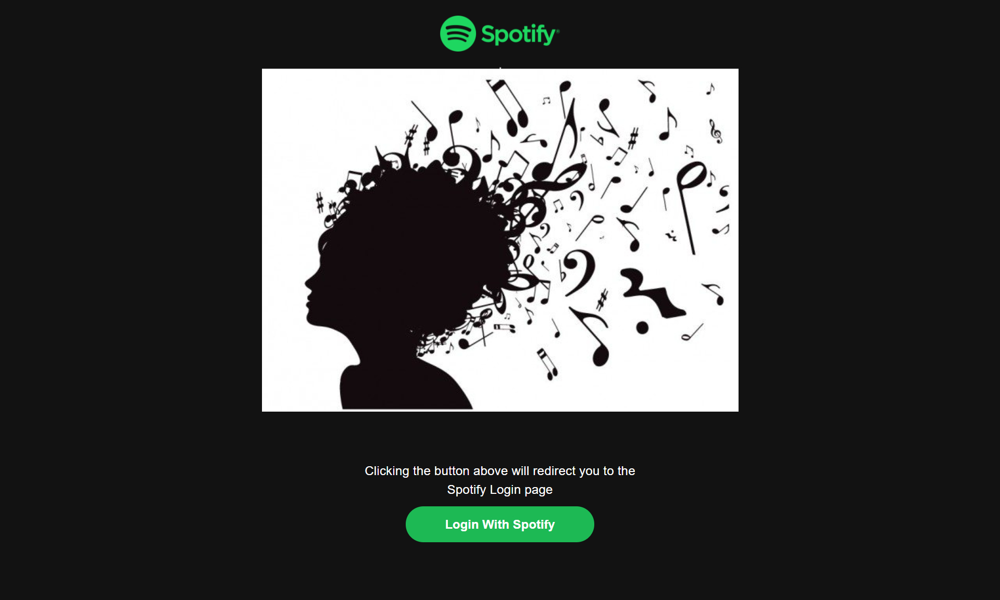
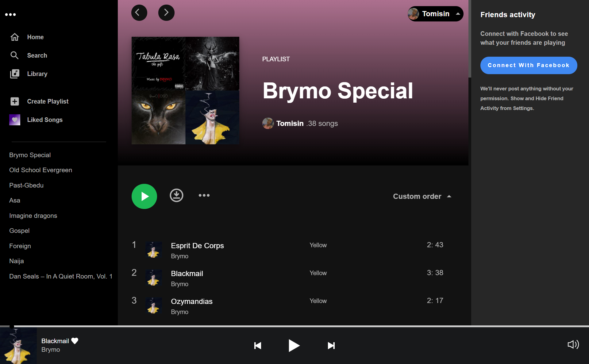
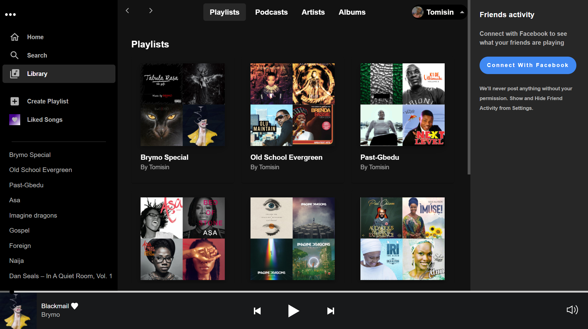

# Spotify Clone Application

This is a front-end clone of the spotify web player. The UI was modelled after the spotify desktop app using React Js, Spotify Web Api, Redux for state management and Material UI for styling.
In this Spotify Clone application you can log in to the application with your spotify account, view your own playlist, select your preferred playlist and listen to your favorite music.

## Preview Link

https://tomi-spotify.vercel.app/

## Authentication

This project uses the spotify OAuth 2.0 service for authenticating the users. [Check for more information](https://developer.spotify.com/documentation/general/guides/authorization/).

## Tech/Framework Used

- React Js
- Redux
- Material UI
- CSS
- [Spotify Web Api](https://developer.spotify.com/documentation/web-api/)

## Installation

This project requires node and npm installed globally.

Clone the repository to a directory of your choosing

```sh
$ git clone https://github.com/Racheal-spec/Tomi-spotify-clone.git
```

Install the necessary packages

```sh
$ npm install
```

To run the server

```sh
$ npm start
```

#### Demo




